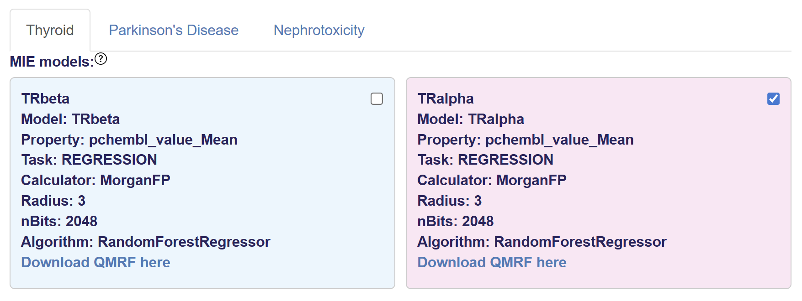
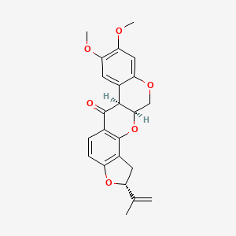

# Step 1: inputs

## Exercise 1
(In a separate window) open <a href="https://qsprpred.cloud.vhp4safety.nl/" target="_blank">qsprpred.cloud.vhp4safety.nl</a>

To anwer the following questions use the thyroid hormone alpha (TRalpha) model. 
Tip: for more detail on the model, use the QMRF document

Q 1.1 What property does this model predict and how is this value derived?

Q 1.2 What algorithm is the QSAR model based on?

Q 1.3 What is the performance of this model on an external validation set?

## Exercise 2

  

Next you want to enter the following molecules; Liothyronine and Rotenone

Q 2 What are the SMILES of these molecules? (tip: use <a href="https://pubchem.ncbi.nlm.nih.gov/" target="_blank">PubChem</a> or Wikipedia for looking up the molecules)

Enter the molecules and click run. Now go to [the next exercises](https://lindeschoenmaker.github.io/results) about result interpretation.

Or go back to [the overview](https://lindeschoenmaker.github.io/).
