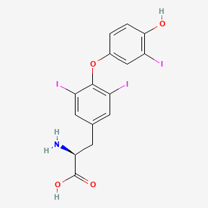
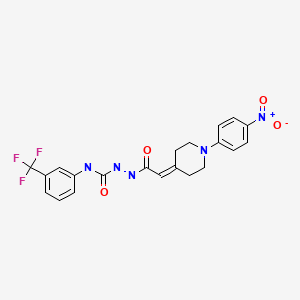

# Step 1: inputs

## Exercise 1

For this exercise you wil be using the thyroid hormone alpha (TRalpha) model. Tip: for more detail on the models, use the QMRF document

Q 1.1 What property does this model predict and how is this value derived?

Q 1.2 What algorithm is the QSAR model based on?

Q 1.3 What is the performance of this model on an external validation set?

## Exercise 2

Next you want to enter the following molecules; Liothyronine and Thyroid Hormone Receptor Antagonist (1-850)

Q 2 What are the SMILES of these molecules? (tip: use [PubChem](https://pubchem.ncbi.nlm.nih.gov/) for looking up the molecules)

Enter the molecules and click run, go to [the next exercises](https://lindeschoenmaker.github.io/results) about result interpretation
